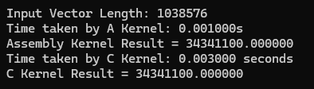
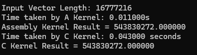

# Dot Product Computation in C

This repository contains the source code of a C program that calculates the dot product between two vectors, utilizing kernels for both x86-64 and C architectures. The execution times of these kernels are compared, with timing measurements provided for different vector sizes.

## Average Execution Time Comparison

### Vector Size = 2^20
- x86-64 Kernel: 0.0007333333333s
- C Kernel: 0.003s

### Vector Size = 2^24
- x86-64 Kernel: 0.0117s
- C Kernel: 0.04456666667s

### Vector Size = 2^30
- x86-64 Kernel: 0.7862666667s
- C Kernel: 2.865633333s

Based on the analysis of execution times, it is evident that the C kernel for computing the dot product of two vectors exhibits notably slower performance compared to its x86-64 counterpart. This discrepancy becomes more pronounced with increasing vector sizes. As depicted in the table above, the disparity in execution times between the C kernel and the x86-64 kernel becomes more conspicuous as the vector size grows. For instance, when the vector size is 2^24, the observed difference in runtime between the two kernels is 0.00227 seconds. This variance, though discernible, is relatively minor. However, when the comparison is extended to much larger vector sizes, such as 2^30, the difference becomes substantial, reaching 2.079367 seconds. These findings underscore the efficiency gap between the C kernel and the x86-64 kernel, particularly under heavier computational loads, where the advantage of the x86-64 architecture becomes more evident.

## Screenshots
### C Output:

### x86-64 Output:

